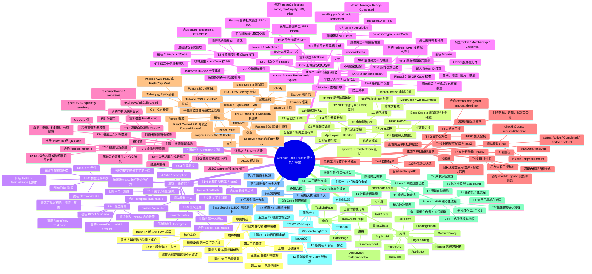

# Onchain Task Tracker 鏈上媒介平台 — 完整心智圖

```mermaid
mindmap
  root((Onchain Task Tracker 鏈上媒介平台))
    專案概述
      核心定位
        需求方與供給方的鏈上媒介
        智能合約確保透明不可竄改
        USDC 穩定幣統一支付
        Base L2 低 Gas EVM 相容
      用戶角色
        需求方 發布需求與付款
        供給方 接受任務與服務
        雙重身份 同一用戶可切換
      四大主題頻道
        主題一 任務媒介
        主題二 NFT 代發行服務
        主題三 餐廳即期食物
        主題四 每日目標清單

    平台核心功能
      C1 錢包連接
        MetaMask / WalletConnect
        WalletContext 全域狀態
        useWallet Hook 封裝
        Header 顯示縮寫地址
      C2 角色選擇
        需求方模式
        供給方模式
        可雙重切換
      C3 主題頻道導覽
        AppLayout + Header
        四頻道切換入口
        各自獨立列表與操作頁
      C4 平台費用機制
        T1 任務媒介 3%
        T2 NFT 代發行 0.5 USDC 每個
        T3 食物販售 2%
        合約自動扣除
      C5 穩定幣支付整合
        USDC ERC-20
        approve + transferFrom 流程
        Base Sepolia 測試網地址待確認

    主題一 任務媒介
      T1-1 建立任務
        需求方填寫標題、描述、報酬
        資金鎖入 Escrow 合約托管
        合約 createTask: taskId, amount
        後端 POST /api/tasks
        前端 /tasks/new → TaskForm
      T1-2 瀏覽任務列表
        供給方看開放任務
        後端 GET /api/tasks
        前端 /tasks → TaskListPage 已實作
        TaskCard 元件
        FilterTabs 篩選
      T1-3 接取任務
        先搶先贏一人獨佔
        合約 acceptTask: taskId
        任務鎖定進 InProgress
      T1-4 任務提交
        供給方提交成果文字或連結
        任務進入 Submitted 狀態
      T1-5 需求方確認完成
        確認後合約自動打款給供給方
        合約 completeTask: taskId
        扣除平台手續費
      T1-6 逾期自動完成 Phase2
        提交後 7 天未確認
        合約自動視為完成
      資料模型 Task
        id / title / description
        reward / status
        creator / executor
        transactionHash

    主題二 NFT 代發行服務
      定位
        廠商完全不需懂區塊鏈
        平台扮演 NFT 技術代工
      T2-1 廠商填寫發行需求
        名稱、描述、圖片、數量
        類型 Ticket / Membership / Credential
        是否需持有者付費
        USDC 服務費支付
        前端 /nft/new
      T2-2 平台代鑄造 NFT
        後端上傳圖片至 IPFS Pinata
        平台服務錢包簽署交易
        Factory 合約批次鑄造 ERC-1155
        合約 createCollection: name, maxSupply, URI, price
        Gas 費由平台服務費支付
      T2-3 兌換連結產生
        後端產生 claimCode 存 DB
        /claim/:claimCode 分享連結
        廠商複製後分發給使用者
      T2-4 終端使用者 Claim NFT
        打開連結顯示 NFT 資訊
        連接錢包後點領取
        合約 claim: collectionId, userAddress
        NFT 鑄造至使用者錢包
        前端 /claim/:claimCode
      T2-5 廠商核銷功能
        輸入 Token ID 核銷
        合約 redeem: tokenId 標記已使用
        不可重複核銷
        Phase2 升級 QR Code 掃描
      T2-6 廠商訂單後台
        /nft/orders 查看訂單
        顯示鑄造 / 已領取 / 已核銷數量
      T2-7 批次空投 Phase2
        CSV 上傳錢包地址名單
        批次空投至持有者
      T2-8 Soulbound Phase2
        NFT 靈魂綁定不可轉讓
        防止黃牛
      資料模型 NFTOrder
        id / name / description
        metadataURI IPFS
        totalSupply / claimed / redeemed
        collectionType / claimCode
        status: Minting / Ready / Completed
      資料模型 NFTItem
        tokenId / collectionId
        ownerAddress
        status: Active / Redeemed / Expired

    主題三 餐廳即期食物
      T3-1 餐廳上架即期食物
        品項、數量、折扣價、有效期限
        USDC 定價
      T3-2 食物列表瀏覽
        消費者瀏覽所有餐廳
        篩選與搜尋
      T3-3 購買食物憑證 NFT
        USDC approve 後 mint NFT
        NFT 含品項與有效期資訊
        消費者持有 NFT 憑證
      T3-4 餐廳核銷憑證
        出示 Token ID 或 QR Code
        合約 redeem: tokenId
        USDC 從合約釋放給餐廳 扣平台費
      T3-5 過期自動退款 Phase2
        超過有效期未核銷
        合約自動退款給買家
        倒計時顯示
      待討論
        餐廳是否需要平台 KYC 審核
      資料模型 FoodListing
        restaurantName / itemName
        priceUSDC / quantity / remaining
        expiresAt / nftCollectionId

    主題四 每日目標清單
      T4-1 建立目標
        目標名稱、週期、保證金金額
        合約 createGoal: goalId, amount, deadline
      T4-2 鎖定保證金
        USDC 鎖入合約
        透明規則無法竄改
      T4-3 每日打卡
        週期內標記目標完成
        合約 checkIn: goalId 記錄時間戳
      T4-4 目標結算
        完成則保證金退還
        未完成則沒收至平台金庫
        合約 settle: goalId
      T4-5 目標歷史紀錄 Phase2
        查看完成率與結算歷史
      T4-6 社群功能 Phase3
        朋友查看目標進度
        互相督促
      待討論
        沒收保證金去向 金庫 / 銷毀 / 慈善
      資料模型 Goal
        id / title / depositAmount
        startDate / endDate
        checkinCount / requiredCheckins
        status: Active / Completed / Failed / Settled

    技術架構
      前端
        React + TypeScript + Vite
        Tailwind CSS + shadcn/ui
        wagmi + viem Web3 Hooks
        React Context API 升級至 Zustand Phase2
        React Router
        Vercel 部署
      後端
        Go + Gin 框架
        PostgreSQL 資料庫
        Railway 或 Fly.io 部署
        平台服務錢包 私鑰安全管理
        Phase2 AWS KMS 或 HashiCorp Vault
      智能合約
        Solidity
        Foundry 框架
        ERC-1155 Factory 合約
        Escrow 合約 T1
        Base L2 主網
        Base Sepolia 測試網
      儲存
        PostgreSQL 結構化資料
        IPFS Pinata NFT Metadata 與圖片
      支付
        USDC 穩定幣
        approve + transferFrom 模式

    已實作前端元件
      頁面
        HomePage
        TaskListPage
        TaskCreatePage
      元件
        Header 含錢包連接
        TaskCard
        TaskForm
        FilterTabs
        SummaryCard
        LoadingButton
        PageLoading
        EmptyState
        AppModal
        ConfirmDialog
        AppButton
      API 層
        taskApi.ts
        dashboardApi.ts
      路由
        AppLayout + router/index.tsx

    開發階段規劃
      Phase 1 MVP 核心主流程
        平台核心 C1 至 C5
        T1 任務媒介主流程
        T2 NFT 代發行核心流程
        T3 餐廳食物核心流程
        T4 每日目標核心流程
        各主題獨立負責人並行開發
      Phase 2 補強進階功能
        T1 逾期自動完成
        T2 批次空投與 Soulbound
        T3 過期自動退款
        T4 歷史紀錄統計
        後台統計圖表
      Phase 3 商業化擴充
        法幣付款 信用卡接入
        QR Code 掃描核銷
        NFT 二手轉售市場
        T4 社群督促功能
        多鏈支援

    團隊分工
      willy88125
        主題一 T1 任務媒介全部
      FF10560
        T2 廠商端 + 後端 + 鑄造
      karven99
        T2 終端使用者 Claim 與核銷
      a7872122-design
        主題三 T3 餐廳食物全部
      Warrenchang0816
        主題四 T4 每日目標全部

    待決定事項
      平台手續費率確認
      T4 保證金沒收去向
      平台服務錢包安全方案
      Base Sepolia USDC 合約地址
      T3 餐廳 KYC 審核機制
      T1 逾期天數 建議 7 天
```
